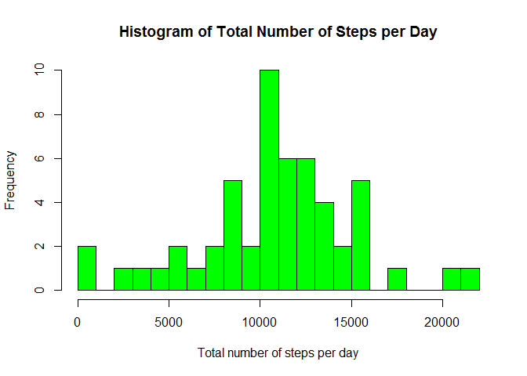
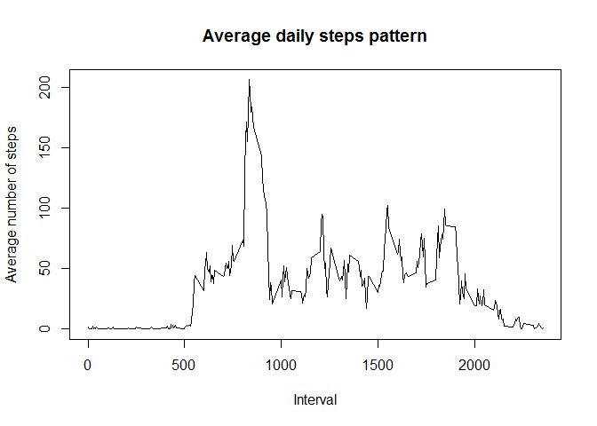
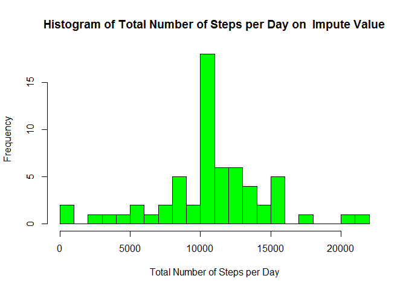
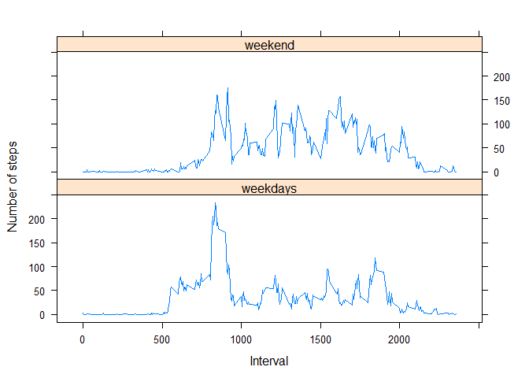

# Reproducible Research: Peer Assessment 1
## Basic Setting

```r
# load all packages
library(knitr)
library(ggplot2)
library(plyr)
library(dplyr)
```

```
## 
## Attaching package: 'dplyr'
## 
## The following objects are masked from 'package:plyr':
## 
##     arrange, count, desc, failwith, id, mutate, rename, summarise,
##     summarize
## 
## The following objects are masked from 'package:stats':
## 
##     filter, lag
## 
## The following objects are masked from 'package:base':
## 
##     intersect, setdiff, setequal, union
```

```r
library(lattice)
library(reshape2)
opts_chunk$set(echo = TRUE)  # make code readable
```
## Loading and preprocessing the data
Show any code that is needed to

1. Load the data (i.e. read.csv())
2. Process/transform the data (if necessary) into a format suitable for your analysis

```r
# create data directory
if(!file.exists("./data")){dir.create("./data")}

unzip("activity.zip",exdir="./data")

data_rows <- read.csv("./data/activity.csv")

data_rows$date <- as.Date(data_rows$date)
# remove NA
data <- data_rows[ with (data_rows, { !(is.na(steps)) } ), ]

head(data)
```

```
##     steps       date interval
## 289     0 2012-10-02        0
## 290     0 2012-10-02        5
## 291     0 2012-10-02       10
## 292     0 2012-10-02       15
## 293     0 2012-10-02       20
## 294     0 2012-10-02       25
```
## What is mean total number of steps taken per day?
For this part of the assignment, you can ignore the missing values in the dataset.

1. Calculate the total number of steps taken per day
2. If you do not understand the difference between a histogram and a barplot, research the difference between them. 
   Make a histogram of the total number of steps taken each day
3. Calculate and report the mean and median of the total number of steps taken per day

```r
by_day <- group_by(data, date)
steps_by_day <- summarise(by_day, total = sum(steps))
steps_by_day
```

```
## Source: local data frame [53 x 2]
## 
##          date total
##        (date) (int)
## 1  2012-10-02   126
## 2  2012-10-03 11352
## 3  2012-10-04 12116
## 4  2012-10-05 13294
## 5  2012-10-06 15420
## 6  2012-10-07 11015
## 7  2012-10-09 12811
## 8  2012-10-10  9900
## 9  2012-10-11 10304
## 10 2012-10-12 17382
## ..        ...   ...
```

```r
hist(steps_by_day$total, main="Histogram of Total Number of Steps per Day", 
     xlab="Total number of steps per day",  ylab = "Frequency", col = "green", 
    breaks = 30)
```

 

```r
# Mean
mean(steps_by_day$total, na.rm = T)
```

```
## [1] 10766.19
```

```r
# Median
median(steps_by_day$total, na.rm = T)
```

```
## [1] 10765
```
**Mean of total number of steps per day is 10766.19, median is 10765**

## What is the average daily activity pattern?
1. Make a time series plot (i.e. type = "l") of the 5-minute interval (x-axis) and the average number of steps taken, averaged across all days (y-axis)
2. Which 5-minute interval, on average across all the days in the dataset, contains the maximum number of steps?
# preprocessing data for plot

```r
steps_by_interval <- aggregate(steps ~ interval, data, mean)
```

# create a time series plot 

```r
plot(steps_by_interval$interval, steps_by_interval$steps, type='l', 
     main="Average daily steps pattern", xlab="Interval", 
     ylab="Average number of steps")
```

 

# find row with max of steps

```r
max_steps_row <- which.max(steps_by_interval$steps)
```

# find interval with this max

```r
steps_by_interval[max_steps_row, ]
```

```
##     interval    steps
## 104      835 206.1698
```
**835th interval has the maximum number of steps**

## Imputing missing values
Note that there are a number of days/intervals where there are missing values (coded as NA). The presence of missing days may introduce bias into some calculations or summaries of the data.

1. Calculate and report the total number of missing values in the dataset (i.e. the total number of rows with NAs)
2. Devise a strategy for filling in all of the missing values in the dataset. The strategy does not need to be           sophisticated. For example, you could use the mean/median for that day, or the mean for that 5-minute interval, etc.
3. Create a new dataset that is equal to the original dataset but with the missing data filled in.
4. Make a histogram of the total number of steps taken each day and Calculate and report the mean and median total number of steps taken per day. Do these values differ from the estimates from the first part of the assignment? What is the impact of imputing missing data on the estimates of the total daily number of steps?


```r
sum(is.na(data_rows))
```

```
## [1] 2304
```
**2304 rows are missing**


```r
mean(data_rows$steps, na.rm = T)
```

```
## [1] 37.3826
```

```r
data_rows$steps[is.na(data_rows$steps)] <- mean(data_rows$steps, na.rm = T)
colSums(is.na(data_rows))
```

```
##    steps     date interval 
##        0        0        0
```

```r
amdimputesteps <- tapply(data_rows$steps, data_rows$date, sum)

amdmeltimpute <- melt(amdimputesteps)
names(amdmeltimpute) <- c("Date", "SumofSteps")
head(amdmeltimpute)
```

```
##         Date SumofSteps
## 1 2012-10-01   10766.19
## 2 2012-10-02     126.00
## 3 2012-10-03   11352.00
## 4 2012-10-04   12116.00
## 5 2012-10-05   13294.00
## 6 2012-10-06   15420.00
```

```r
hist(amdmeltimpute$SumofSteps, main = "Histogram of Total Number of Steps per Day on  Impute Value", 
    xlab = "Total Number of Steps per Day", ylab = "Frequency", col = "green", 
    breaks = 30)
```

 

```r
mean(amdmeltimpute$SumofSteps, na.rm = T)
```

```
## [1] 10766.19
```

```r
median(amdmeltimpute$SumofSteps, na.rm = T)
```

```
## [1] 10766.19
```
**Mean and median are the same**

## Are there differences in activity patterns between weekdays and weekends?
For this part the weekdays() function may be of some help here. Use the dataset with the filled-in missing values for this part.

1. Create a new factor variable in the dataset with two levels - "weekday" and "weekend" indicating whether a given date is a weekday or weekend day.
2. Make a panel plot containing a time series plot (i.e. type = "l") of the 5-minute interval (x-axis) and the average number of steps taken, averaged across all weekday days or weekend days (y-axis). See the README file in the GitHub repository to see an example of what this plot should look like using simulated data.


```r
data$weekdays <- weekdays(data$date)

data$weeks[(data$weekdays == "Saturday" | data$weekdays == "Sunday")] <- "weekend"
data$weeks[!(data$weekdays == "Saturday" | data$weekdays == "Sunday")] <- "weekdays"

week_comp <- ddply(data, c("interval", "weeks"), function(x) apply(x[1], 
    2, mean))
head(week_comp)
```

```
##   interval    weeks     steps
## 1        0 weekdays 2.3333333
## 2        0  weekend 0.0000000
## 3        5 weekdays 0.4615385
## 4        5  weekend 0.0000000
## 5       10 weekdays 0.1794872
## 6       10  weekend 0.0000000
```

```r
xyplot(steps ~ interval | weeks, data = week_comp, type = "l", xlab = "Interval", 
    ylab = "Number of steps", layout = c(1, 2))
```

 

**More activity on the weekend compare to weekdays**
